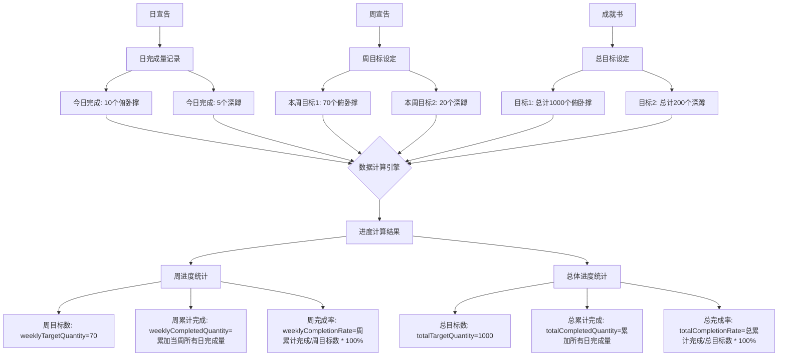

# 置换之光宣告系统流程图

```mermaid
graph TD
    A[成就书] --> B[总目标设定]
    B --> C[目标1: 总计1000个俯卧撑]
    B --> D[目标2: 总计200个深蹲]
    
    E[周宣告] --> F[周目标设定]
    F --> G[本周目标1: 70个俯卧撑]
    F --> H[本周目标2: 20个深蹲]
    
    I[日宣告] --> J[日完成量记录]
    J --> K[今日完成: 10个俯卧撑]
    J --> L[今日完成: 5个深蹲]
    
    K --> M{数据计算引擎}
    L --> M
    G --> M
    H --> M
    C --> M
    D --> M
    
    M --> N[进度计算结果]
    
    N --> O[周进度统计]
    O --> P[周目标数: weeklyTargetQuantity=70]
    O --> Q[周累计完成: weeklyCompletedQuantity=累加当周所有日完成量]
    O --> R[周完成率: weeklyCompletionRate=周累计完成/周目标数 * 100%]
    
    N --> S[总体进度统计]
    S --> T[总目标数: totalTargetQuantity=1000]
    S --> U[总累计完成: totalCompletedQuantity=累加所有日完成量]
    S --> V[总完成率: totalCompletionRate=总累计完成/总目标数 * 100%]
```